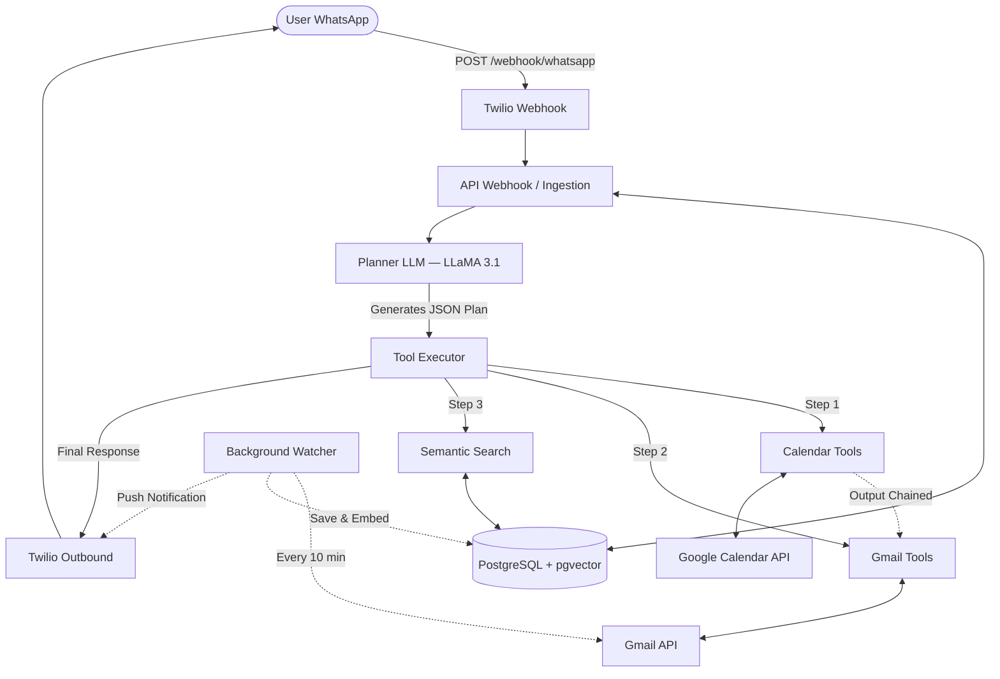

<p align="center">
  <h1 align="center">🤖 AgentFlow</h1>
  <p align="center">
    <strong>A fully autonomous, ReAct-style AI Executive Assistant that lives on WhatsApp.</strong>
  </p>
  <p align="center">
    <a href="#architecture">Architecture</a> •
    <a href="#features">Features</a> •
    <a href="#how-it-works">How It Works</a> •
    <a href="#getting-started">Getting Started</a> •
    <a href="#tech-stack">Tech Stack</a>
  </p>
</p>

---

## What is AgentFlow?

AgentFlow is an **AI-powered Executive Assistant** you interact with entirely through WhatsApp. Send it a natural language message like _"Schedule a 30 min meeting with Id 6 for tomorrow at 2 pm and draft a mail sending them the link"_ — and it will:

1. **Plan** — An LLM (LLaMA 3.1 via Groq) parses your intent and generates a structured JSON execution plan.
2. **Execute** — A tool executor runs each step sequentially, **chaining outputs** between tools (e.g. a Google Meet link from the calendar step is auto-injected into the email draft).
3. **Respond** — The final result is sent back to your WhatsApp via Twilio.

No buttons. No UI. Just natural conversation → autonomous action.

---

## Features

| Feature | Description |
|---|---|
| 🧠 **ReAct-style Planning** | LLM analyzes intent and outputs a multi-step JSON execution plan |
| ⛓️ **Output Chaining** | Results from Step N are automatically fed into Step N+1 |
| 📧 **Gmail Integration** | Read, search (semantic + keyword), compose, edit drafts, and send emails |
| 📅 **Google Calendar** | Check schedule, create events with auto-generated Google Meet links |
| 🔍 **Semantic Search** | Emails are embedded with `all-MiniLM-L6-v2` and stored in `pgvector` for vector similarity search |
| 📲 **Background Watcher** | Polls Gmail every 10 minutes, saves new emails to the DB, and pushes WhatsApp notifications |
| 🗂️ **Stateless Architecture** | All state lives in PostgreSQL — the server holds zero in-memory state |
| 🔌 **Plugin Registry** | Add new tools with a single `@registry.register` decorator — the Planner auto-discovers them |

---

## Architecture



---

## How It Works

Every WhatsApp message triggers the following pipeline:

### 1. Ingestion — `api/webhooks.py`
- Twilio sends a `POST` to `/webhook/whatsapp`.
- The system extracts the phone number and message body.
- A **Session** is retrieved (or created) from PostgreSQL, and the message is appended to `conversation_history`.

### 2. Planning — `agent/planner.py`
- The last 20 messages are loaded for conversational context.
- A structured prompt is sent to **LLaMA 3.1** (via Groq, at `temperature=0.0`) containing:
  - The user's request, current datetime, conversation history, and a full list of available tools.
- The LLM returns a **pure JSON execution plan**:
  ```json
  [
    {"tool": "calendar.schedule_meeting", "args": {"summary": "Catchup", "start_iso": "...", "end_iso": "...", "email_id": 6}},
    {"tool": "gmail.compose", "args": {"instruction": "Send them the meeting link", "email_id": 6}}
  ]
  ```

### 3. Execution — `agent/executor.py`
- The Executor iterates through the plan and runs each tool.
- **Output Chaining**: The output of Step N is injected into Step N+1 as `previous_output` inside a `context` dict. This is how a Google Meet link from a calendar event automatically appears in a composed email draft.
- Tools receive `db`, `session_obj`, and `session_manager` via `inspect.signature` introspection — only tools that declare a `context` parameter receive it.

### 4. Tool Execution — `tools/`
- Tools are registered with a simple decorator:
  ```python
  @registry.register("gmail.compose", "Draft or edit an email. Args: instruction, email_id, to_email.")
  def compose_email(instruction: str, email_id=None, to_email=None, context=None):
      ...
  ```
- **`gmail.compose`** uses a secondary LLM call to draft a professional email reply.
- **`calendar.schedule_meeting`** auto-extracts the attendee email from the DB and sends a native Google Calendar invite with a Meet link.

### 5. Response
- The final output string is saved to `conversation_history` and sent back via Twilio.

### Background Watcher
An `asyncio` loop in `main.py` runs every 10 minutes:
1. Fetches unread primary emails from Gmail.
2. Generates a 384-dim vector embedding with `SentenceTransformer`.
3. Saves the email + embedding to PostgreSQL (`pgvector`).
4. Sends a WhatsApp push notification with the email's database `Id`.

---

## Project Structure

```
backend/
├── main.py                     # FastAPI app + background email watcher
├── agent/
│   ├── planner.py              # LLM-based intent → JSON plan
│   ├── executor.py             # Sequential tool execution with output chaining
│   ├── registry.py             # @register decorator + tool discovery
│   └── session.py              # Per-user session manager (PostgreSQL-backed)
├── api/
│   ├── routes.py               # Health check endpoint
│   └── webhooks.py             # Twilio WhatsApp webhook controller
├── core/
│   ├── config.py               # Pydantic settings (.env loader)
│   ├── database.py             # SQLAlchemy engine + session factory
│   └── embedder.py             # Lazy-loaded SentenceTransformer
├── models/
│   └── schema.py               # Email & Session SQLAlchemy models
├── services/
│   ├── gmail_service.py        # Gmail API (OAuth, send, sync)
│   ├── calendar_service.py     # Google Calendar API (events, Meet links)
│   ├── llm_service.py          # Groq LLM (draft emails, summarize, Q&A)
│   └── whatsapp_service.py     # Twilio outbound messaging
├── tools/
│   ├── gmail_tools.py          # Registered tools: get_latest, read, search, compose, send
│   └── calendar_tools.py       # Registered tools: get_schedule, schedule_meeting
├── requirements.txt
└── .env.example
```

---

## Getting Started

### Prerequisites
- Python 3.11+
- PostgreSQL with the [`pgvector`](https://github.com/pgvector/pgvector) extension enabled
- A [Twilio](https://www.twilio.com/) account with WhatsApp Sandbox
- A [Groq](https://console.groq.com/) API key
- Google Cloud project with **Gmail API** and **Calendar API** enabled + OAuth 2.0 credentials (`credentials.json`)

### Installation

```bash
# Clone the repo
git clone https://github.com/preetham-nandyala/AgentFlow.git
cd AgentFlow/backend

# Create a virtual environment
python -m venv venv
source venv/bin/activate   # On Windows: venv\Scripts\activate

# Install dependencies
pip install -r requirements.txt

# Set up environment variables
cp .env.example .env
# Edit .env with your actual API keys and database URL

# Place your Google OAuth credentials
# Download credentials.json from Google Cloud Console and place it in backend/

# Run the server
uvicorn main:app --host 0.0.0.0 --port 8000 --reload
```

### Twilio Webhook Setup
Point your Twilio WhatsApp Sandbox webhook to:
```
https://<your-domain>/webhook/whatsapp
```
Use [ngrok](https://ngrok.com/) for local development: `ngrok http 8000`

---

## Tech Stack

| Layer | Technology |
|---|---|
| **API Framework** | FastAPI (Python) |
| **LLM** | Groq API — LLaMA 3.1 8B Instant |
| **Database** | PostgreSQL (Supabase) + SQLAlchemy |
| **Vector Search** | pgvector + SentenceTransformer (`all-MiniLM-L6-v2`) |
| **Messaging** | Twilio WhatsApp API |
| **Integrations** | Gmail API (OAuth 2.0), Google Calendar API (OAuth 2.0) |

---

## Extensibility

The architecture is designed for easy extension. To add a new capability (e.g. Slack, GitHub, Notion):

1. Create a service in `services/` for the API integration.
2. Register tool functions in `tools/` using the `@registry.register` decorator.
3. That's it — the Planner automatically discovers new tools and knows how to use them.

```python
@registry.register("slack.send", "Send a message to a Slack channel. Args: channel, message.")
def send_slack(channel: str, message: str, context: dict = None) -> str:
    # Your Slack API logic here
    ...
```

---

## License

This project is licensed under the MIT License — see the [LICENSE](LICENSE) file for details.
